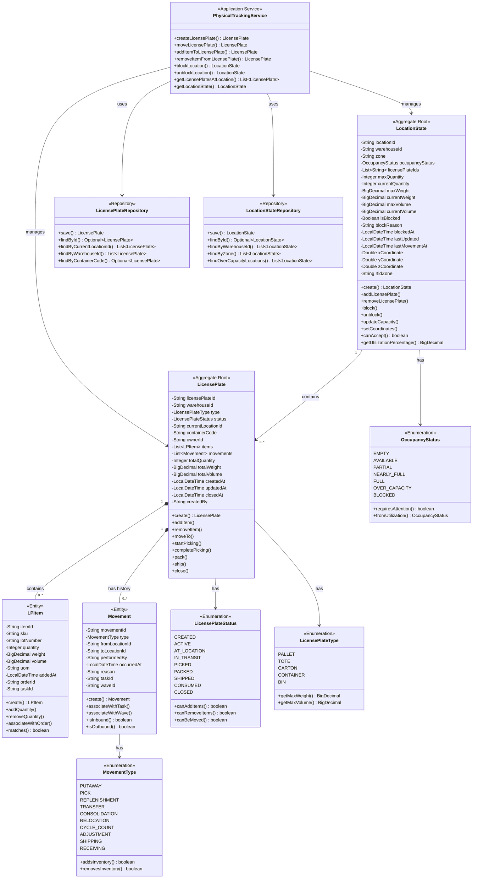
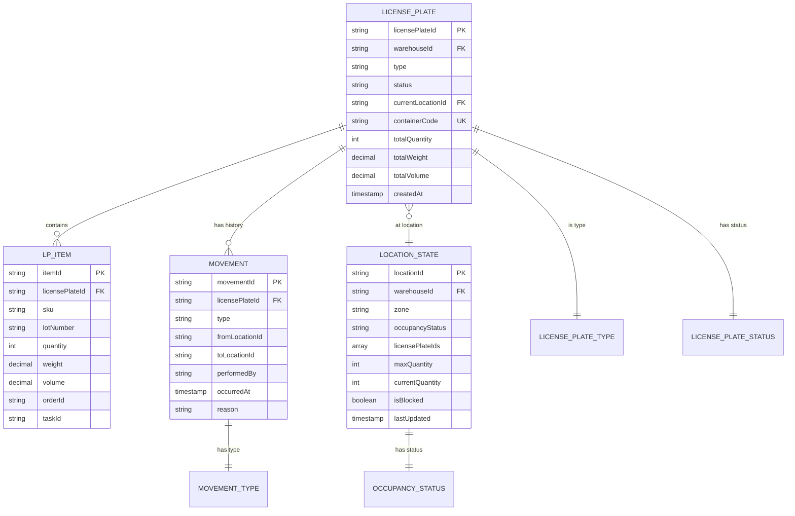

# Physical Tracking Service - Domain Model

## Overview

The Physical Tracking Service domain model is designed around two primary aggregate roots that represent the physical world of the warehouse: **License Plates** (physical containers) and **Location States** (physical location occupancy).

## Domain Model Diagram



## Aggregate Roots

### 1. LicensePlate

**Purpose**: Represents a physical container (pallet, tote, carton) that holds inventory and moves through the warehouse.

**Key Responsibilities**:
- Manage inventory items on the container
- Track movement history between locations
- Enforce state transition rules
- Calculate totals (quantity, weight, volume)
- Associate with orders and tasks

**Invariants**:
- Cannot add items in SHIPPED, CONSUMED, or CLOSED status
- Cannot remove more items than available
- Cannot move license plate in invalid states
- Total quantity must match sum of item quantities
- Movement history is append-only

**Business Rules**:
```java
// Items with same SKU and lot are consolidated
lp.addItem("SKU-001", "LOT-A", 10, ...);
lp.addItem("SKU-001", "LOT-A", 5, ...); // Results in 15 total

// Status transitions follow strict rules
lp.status = CREATED -> ACTIVE (when first item added)
lp.status = ACTIVE -> AT_LOCATION (when moved to location)
lp.status = AT_LOCATION -> PICKED (when picking starts)
lp.status = PICKED -> CONSUMED (when all items removed)

// Empty license plates become CONSUMED
lp.removeItem("SKU-001", "LOT-A", 15);
// Status automatically becomes CONSUMED if no items remain
```

### 2. LocationState

**Purpose**: Represents the real-time physical state of a warehouse location including occupancy, capacity, and constraints.

**Key Responsibilities**:
- Track license plates at location
- Monitor capacity utilization
- Enforce capacity constraints
- Calculate utilization percentage
- Manage location blocking
- Store RTLS coordinates

**Invariants**:
- Current quantities cannot exceed max capacity (with tolerance)
- Blocked locations reject new license plates
- License plate IDs list matches physical reality
- Utilization percentage accurately reflects constraints
- Coordinates are valid if RTLS enabled

**Business Rules**:
```java
// Capacity check considers all dimensions
locationState.canAccept(quantity, weight, volume);
// Returns false if ANY constraint would be exceeded

// Utilization is based on most restrictive dimension
utilization = max(
    currentQty / maxQty * 100,
    currentWeight / maxWeight * 100,
    currentVolume / maxVolume * 100
)

// Occupancy status automatically updates
0% = EMPTY
1-49% = AVAILABLE
50-84% = PARTIAL
85-99% = NEARLY_FULL
100% = FULL
>100% = OVER_CAPACITY

// Blocked locations override occupancy
locationState.block("Maintenance");
locationState.occupancyStatus = BLOCKED; // Regardless of utilization
```

## Entities

### LPItem

**Purpose**: Individual inventory item on a license plate with quantity, lot, and associations.

**Key Attributes**:
- `sku`: Product identifier
- `lotNumber`: Batch/lot tracking
- `quantity`: Current quantity on LP
- `weight`/`volume`: Physical dimensions
- `orderId`: Associated order (if allocated)
- `taskId`: Associated task (if active)

**Operations**:
```java
// Add quantity to existing item
lpItem.addQuantity(10);

// Remove quantity with validation
lpItem.removeQuantity(5); // Throws if insufficient

// Check if matches SKU and lot
lpItem.matches("SKU-001", "LOT-A"); // true/false
```

### Movement

**Purpose**: Historical record of a license plate moving between locations.

**Key Attributes**:
- `type`: Type of movement (PUTAWAY, PICK, TRANSFER, etc.)
- `fromLocationId`: Origin location (null if receiving)
- `toLocationId`: Destination location (null if shipping)
- `performedBy`: Worker/system that performed movement
- `occurredAt`: Timestamp of movement
- `reason`: Business reason for movement
- `taskId`/`waveId`: Associated task or wave

**Operations**:
```java
// Create movement record
Movement movement = Movement.create(
    MovementType.PICK,
    "LOC-001",
    "STAGING-01",
    "WORKER-123",
    "Order picking"
);

// Check if adds/removes inventory
movement.isInbound(); // true for PUTAWAY, RECEIVING
movement.isOutbound(); // true for PICK, SHIPPING
```

## Value Objects

### LicensePlateStatus

Represents the lifecycle state of a license plate:

| Status | Description | Can Add Items | Can Remove Items | Can Move |
|--------|-------------|---------------|------------------|----------|
| CREATED | Newly created, empty | Yes | No | Yes |
| ACTIVE | Contains items | Yes | Yes | Yes |
| AT_LOCATION | Resting at location | No | Yes | Yes |
| IN_TRANSIT | Moving between locations | No | No | No |
| PICKED | Being picked from | No | Yes | No |
| PACKED | Packed for shipping | No | No | Yes |
| SHIPPED | Shipped out | No | No | No |
| CONSUMED | All items removed | No | No | Yes |
| CLOSED | Permanently closed | No | No | No |

### LicensePlateType

Physical container types with different characteristics:

```java
public enum LicensePlateType {
    PALLET,      // 40x48 pallet, 2000 lbs
    TOTE,        // Small plastic tote, 50 lbs
    CARTON,      // Cardboard box, 100 lbs
    CONTAINER,   // ISO container, 10000 lbs
    BIN;         // Storage bin, 200 lbs

    public BigDecimal getMaxWeight() { ... }
    public BigDecimal getMaxVolume() { ... }
}
```

### MovementType

Categories of movements with inventory impact:

```java
public enum MovementType {
    PUTAWAY,         // Adds inventory to location
    PICK,            // Removes inventory from location
    REPLENISHMENT,   // Moves inventory to pick face
    TRANSFER,        // Moves inventory between locations
    CONSOLIDATION,   // Combines license plates
    RELOCATION,      // Moves for optimization
    CYCLE_COUNT,     // Counting movement
    ADJUSTMENT,      // Correction movement
    SHIPPING,        // Outbound shipment
    RECEIVING;       // Inbound receipt

    public boolean addsInventory() { ... }
    public boolean removesInventory() { ... }
}
```

### OccupancyStatus

Location occupancy levels:

```java
public enum OccupancyStatus {
    EMPTY,          // 0% utilized
    AVAILABLE,      // 1-49% utilized
    PARTIAL,        // 50-84% utilized
    NEARLY_FULL,    // 85-99% utilized
    FULL,           // 100% utilized
    OVER_CAPACITY,  // >100% utilized (violation)
    BLOCKED;        // Not available

    public boolean requiresAttention() {
        return this == OVER_CAPACITY || this == BLOCKED;
    }

    public static OccupancyStatus fromUtilization(double pct) {
        if (pct == 0) return EMPTY;
        if (pct < 50) return AVAILABLE;
        if (pct < 85) return PARTIAL;
        if (pct < 100) return NEARLY_FULL;
        if (pct == 100) return FULL;
        return OVER_CAPACITY;
    }
}
```

## Repositories

### LicensePlateRepository

MongoDB repository for license plate aggregates:

```java
public interface LicensePlateRepository {
    LicensePlate save(LicensePlate licensePlate);
    Optional<LicensePlate> findById(String licensePlateId);
    List<LicensePlate> findByCurrentLocationId(String locationId);
    List<LicensePlate> findByWarehouseId(String warehouseId);
    Optional<LicensePlate> findByContainerCode(String containerCode);
    List<LicensePlate> findByStatus(LicensePlateStatus status);
}
```

**Indexes**:
- Primary: `licensePlateId`
- Secondary: `warehouseId`, `currentLocationId`, `containerCode`, `status`, `createdAt`

### LocationStateRepository

MongoDB repository for location state documents:

```java
public interface LocationStateRepository {
    LocationState save(LocationState state);
    Optional<LocationState> findById(String locationId);
    List<LocationState> findByWarehouseId(String warehouseId);
    List<LocationState> findByWarehouseIdAndZone(String warehouseId, String zone);
    List<LocationState> findOverCapacityLocations(String warehouseId);
    List<LocationState> findBlockedLocations(String warehouseId);
}
```

**Indexes**:
- Primary: `locationId`
- Secondary: `warehouseId`, `zone`, `occupancyStatus`, `isBlocked`, `lastUpdated`

## Entity Relationships



## Domain Events

Events published by the Physical Tracking Service:

### LicensePlateCreatedEvent
```json
{
  "eventType": "LICENSE_PLATE_CREATED",
  "licensePlateId": "LP-12345",
  "warehouseId": "WH-001",
  "type": "PALLET",
  "containerCode": "P-ABC123",
  "createdBy": "WORKER-001",
  "timestamp": "2025-10-19T10:30:00Z"
}
```

### LicensePlateMovedEvent
```json
{
  "eventType": "LICENSE_PLATE_MOVED",
  "licensePlateId": "LP-12345",
  "fromLocationId": "LOC-A-01",
  "toLocationId": "LOC-B-05",
  "movementType": "PICK",
  "performedBy": "WORKER-001",
  "timestamp": "2025-10-19T11:45:00Z"
}
```

### ItemAddedEvent
```json
{
  "eventType": "ITEM_ADDED",
  "licensePlateId": "LP-12345",
  "sku": "SKU-001",
  "quantity": 100,
  "locationId": "LOC-A-01",
  "timestamp": "2025-10-19T10:35:00Z"
}
```

### LocationBlockedEvent
```json
{
  "eventType": "LOCATION_BLOCKED",
  "locationId": "LOC-A-01",
  "warehouseId": "WH-001",
  "reason": "Damaged rack - safety inspection required",
  "timestamp": "2025-10-19T14:00:00Z"
}
```

## Bounded Context

The Physical Tracking bounded context focuses on:
- **IN SCOPE**: Physical location of containers, movement history, location occupancy
- **OUT OF SCOPE**: Inventory quantities (Inventory Service), location configuration (Location Master), task management (Task Execution)

**Context Boundaries**:
- Tracks WHERE things are, not HOW MUCH (inventory quantities)
- Tracks WHAT moved, not WHY (task reasons)
- Tracks location STATE, not location CONFIGURATION

## Design Patterns

### 1. Aggregate Pattern
- License Plate and Location State are aggregate roots
- All modifications go through aggregate root methods
- Transactional consistency within aggregate boundaries

### 2. Repository Pattern
- Abstracts data access for aggregates
- Provides collection-like interface
- Enables different storage implementations

### 3. Domain Events
- Aggregates publish events on state changes
- Enables loose coupling between bounded contexts
- Supports event sourcing if needed

### 4. Value Objects
- Immutable objects with no identity
- Enums for status and type information
- Self-validating business concepts
