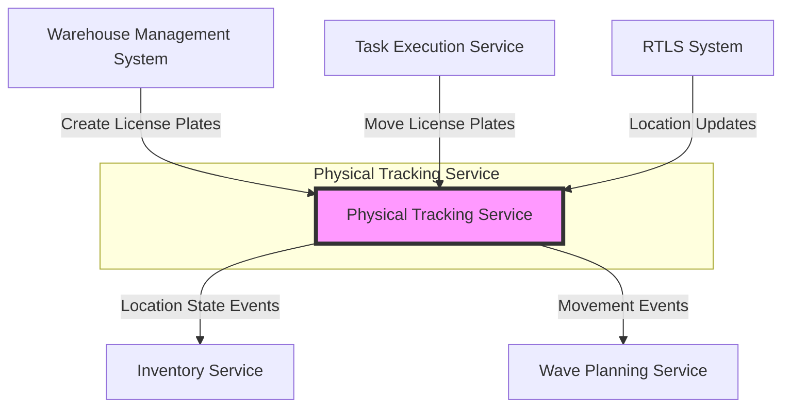

# Physical Tracking Service

## Overview

The Physical Tracking Service is a critical microservice in the PakLog WMS that provides real-time tracking of physical assets, license plates (containers), and their movements throughout the warehouse. It maintains the current state of all physical locations and enables precise inventory location management.

## Purpose

This service solves the fundamental problem of "where is my inventory?" by:
- Tracking license plates (pallets, totes, cartons) and their contents
- Monitoring real-time location state and occupancy
- Recording movement history between locations
- Managing location capacity and utilization
- Integrating with RTLS (Real-Time Location Systems) for precise positioning

## Architecture

### Technology Stack

- **Framework**: Spring Boot 3.x
- **Database**: MongoDB (Document-oriented for flexible tracking data)
- **Event Bus**: Kafka for publishing tracking events
- **API Style**: RESTful HTTP + Event-Driven

### Architectural Style

The service follows **Domain-Driven Design (DDD)** principles with:
- **Aggregate Roots**: LicensePlate, LocationState
- **Entities**: LPItem, Movement
- **Value Objects**: LicensePlateStatus, LicensePlateType, MovementType, OccupancyStatus
- **Repositories**: LicensePlateRepository, LocationStateRepository
- **Application Services**: PhysicalTrackingService

### System Context



## Core Concepts

### License Plate

A **License Plate** is a physical container (pallet, tote, carton) that:
- Holds inventory items (SKUs with quantities)
- Moves through the warehouse
- Has a barcode/RFID for scanning
- Tracks its current location and movement history
- Maintains item contents and totals

**Lifecycle States**:
- `CREATED` - New license plate created
- `ACTIVE` - Contains items and ready for operations
- `AT_LOCATION` - Resting at a specific location
- `IN_TRANSIT` - Moving between locations
- `PICKED` - Being picked from
- `PACKED` - Packed for shipping
- `SHIPPED` - Shipped out
- `CONSUMED` - All items removed
- `CLOSED` - Permanently closed

### Location State

A **Location State** represents the real-time physical state of a warehouse location:
- Current occupancy (empty, partial, full, over capacity)
- List of license plates present
- Capacity utilization (quantity, weight, volume)
- Block status for safety or maintenance
- RTLS coordinates for precise positioning

**Occupancy Status**:
- `EMPTY` - No inventory
- `AVAILABLE` - <50% utilized
- `PARTIAL` - 50-85% utilized
- `NEARLY_FULL` - 85-100% utilized
- `FULL` - 100% utilized
- `OVER_CAPACITY` - >100% utilized
- `BLOCKED` - Not available for operations

### Movement

A **Movement** is a historical record of a license plate moving between locations:
- Movement type (putaway, pick, transfer, replenishment, etc.)
- From/to locations
- Timestamp and performer
- Associated task or wave
- Reason for movement

## Key Features

### 1. License Plate Management
- Create new license plates with container codes
- Add/remove items to/from license plates
- Track item quantities, weights, and volumes
- Associate items with orders and tasks

### 2. Movement Tracking
- Record all movements between locations
- Maintain complete movement history
- Track dwell time at locations
- Link movements to tasks and waves

### 3. Location State Management
- Real-time occupancy tracking
- Capacity monitoring (quantity, weight, volume)
- Location blocking/unblocking
- Utilization percentage calculation

### 4. RTLS Integration
- Store precise X/Y/Z coordinates
- Map locations to RFID zones
- Support real-time location updates

### 5. Event Publishing
- License plate created/moved events
- Item added/removed events
- Location blocked/unblocked events
- Integration with downstream services

## API Endpoints

### License Plate Operations

```http
POST   /api/physical-tracking/license-plates
GET    /api/physical-tracking/license-plates/{id}
POST   /api/physical-tracking/license-plates/{id}/items
DELETE /api/physical-tracking/license-plates/{id}/items
POST   /api/physical-tracking/license-plates/{id}/move
GET    /api/physical-tracking/locations/{locationId}/license-plates
```

### Location State Operations

```http
GET    /api/physical-tracking/locations/{locationId}/state
GET    /api/physical-tracking/warehouses/{warehouseId}/locations
POST   /api/physical-tracking/locations/{locationId}/block
POST   /api/physical-tracking/locations/{locationId}/unblock
```

## Integration Points

### Consumes Events From
- **Inventory Service**: Inventory received, adjusted
- **Task Execution Service**: Task started, completed
- **Wave Planning Service**: Wave released, completed

### Publishes Events To
- **Inventory Service**: Location state changes
- **Task Execution Service**: Movement confirmations
- **Warehouse Operations**: Capacity alerts
- **Analytics**: Movement analytics

## Data Model

The service uses MongoDB for flexible document storage:

### Collections
- `license_plates` - License plate aggregates with items and movements
- `location_states` - Real-time location state documents

### Indexes
- `licensePlateId` (primary key)
- `warehouseId` + `currentLocationId` (queries by location)
- `containerCode` (barcode lookups)
- `locationId` + `warehouseId` (location state queries)
- `createdAt`, `lastUpdated` (temporal queries)

## Configuration

### Environment Variables

```properties
# MongoDB Configuration
spring.data.mongodb.uri=mongodb://localhost:27017/physical-tracking
spring.data.mongodb.database=physical-tracking

# Kafka Configuration
spring.kafka.bootstrap-servers=localhost:9092
spring.kafka.producer.key-serializer=org.apache.kafka.common.serialization.StringSerializer
spring.kafka.producer.value-serializer=org.springframework.kafka.support.serializer.JsonSerializer

# Service Configuration
physical-tracking.rtls.enabled=true
physical-tracking.rtls.update-interval=5000
```

## Monitoring and Metrics

### Key Metrics
- License plates created/moved per hour
- Average dwell time per location
- Location utilization percentage
- Movement processing time
- Event publishing success rate

### Health Checks
- MongoDB connectivity
- Kafka producer health
- RTLS system connectivity (if enabled)

## Business Rules

1. **License Plate Items**
   - Cannot add items to shipped or consumed license plates
   - Items with same SKU and lot are consolidated
   - Removing items beyond available quantity throws error

2. **Movements**
   - License plates in transit cannot be moved again until arrival
   - Moving to same location is rejected
   - Movement history is immutable

3. **Location State**
   - Blocked locations reject new license plates
   - Over-capacity locations trigger alerts
   - Location state automatically updates on LP movements

4. **Capacity Management**
   - Capacity checks consider quantity, weight, and volume
   - Maximum constraint determines if location is full
   - Utilization based on most restrictive dimension

## Error Handling

### Common Errors
- `LICENSE_PLATE_NOT_FOUND` - License plate ID doesn't exist
- `INVALID_STATE_TRANSITION` - Illegal status change
- `CAPACITY_EXCEEDED` - Location cannot accept license plate
- `LOCATION_BLOCKED` - Attempt to use blocked location
- `ITEM_NOT_FOUND` - Item doesn't exist on license plate

## Performance Considerations

### Scalability
- Horizontal scaling via stateless service design
- MongoDB sharding by warehouseId for multi-tenant
- Event publishing is asynchronous and non-blocking

### Optimization
- Indexes on common query patterns
- Aggregate root boundaries prevent cross-aggregate queries
- Location state caching for high-frequency reads

## Testing Strategy

### Unit Tests
- Domain model behavior (state transitions, validation)
- Business rule enforcement
- Calculation logic (totals, utilization)

### Integration Tests
- MongoDB repository operations
- Event publishing to Kafka
- REST API endpoints

### E2E Tests
- Complete license plate lifecycle
- Movement between multiple locations
- Capacity constraint enforcement

## Deployment

### Prerequisites
- MongoDB 5.0+
- Kafka 3.0+
- Java 21+

### Docker Deployment

```bash
docker build -t paklog/physical-tracking-service:latest .
docker run -p 8080:8080 \
  -e SPRING_DATA_MONGODB_URI=mongodb://mongo:27017/physical-tracking \
  -e SPRING_KAFKA_BOOTSTRAP_SERVERS=kafka:9092 \
  paklog/physical-tracking-service:latest
```

## Future Enhancements

1. **RTLS Deep Integration**
   - Real-time position streaming
   - Automated location detection
   - Geofencing for movement validation

2. **Advanced Analytics**
   - Movement pattern analysis
   - Location hotspot detection
   - Dwell time optimization

3. **Blockchain Integration**
   - Immutable movement history
   - Chain of custody tracking
   - Audit trail for compliance

4. **Machine Learning**
   - Predict dwell times
   - Anomaly detection (lost items)
   - Optimal location assignment

## Related Services

- **Location Master Service** - Location configuration and slotting
- **Inventory Service** - Inventory quantities and allocations
- **Task Execution Service** - Task-driven movements
- **Warehouse Operations** - High-level warehouse control

## Support and Contacts

- **Team**: Warehouse Execution Team
- **Slack**: #wms-physical-tracking
- **On-Call**: physical-tracking-oncall@paklog.com
