# Physical Tracking Service - Sequence Diagrams

## Overview

This document contains sequence diagrams for key operational flows in the Physical Tracking Service.

## 1. Create License Plate and Add Items

This flow shows how a new license plate is created and items are added during receiving or putaway operations.

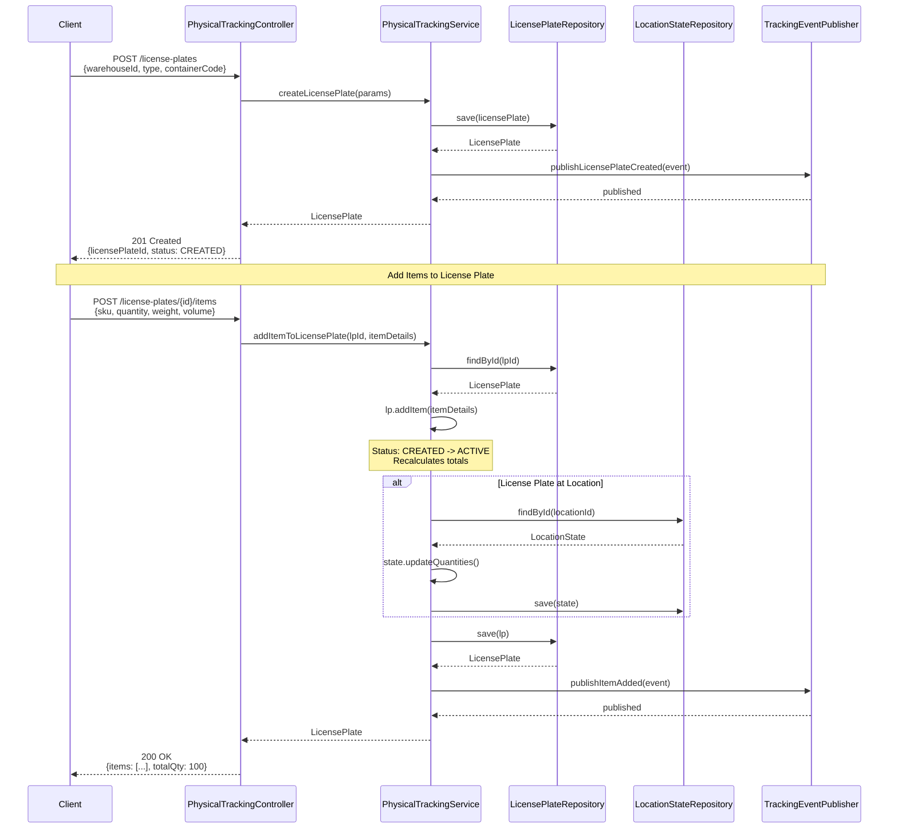

## 2. Move License Plate Between Locations

This flow demonstrates the movement of a license plate from one location to another, with automatic location state updates.

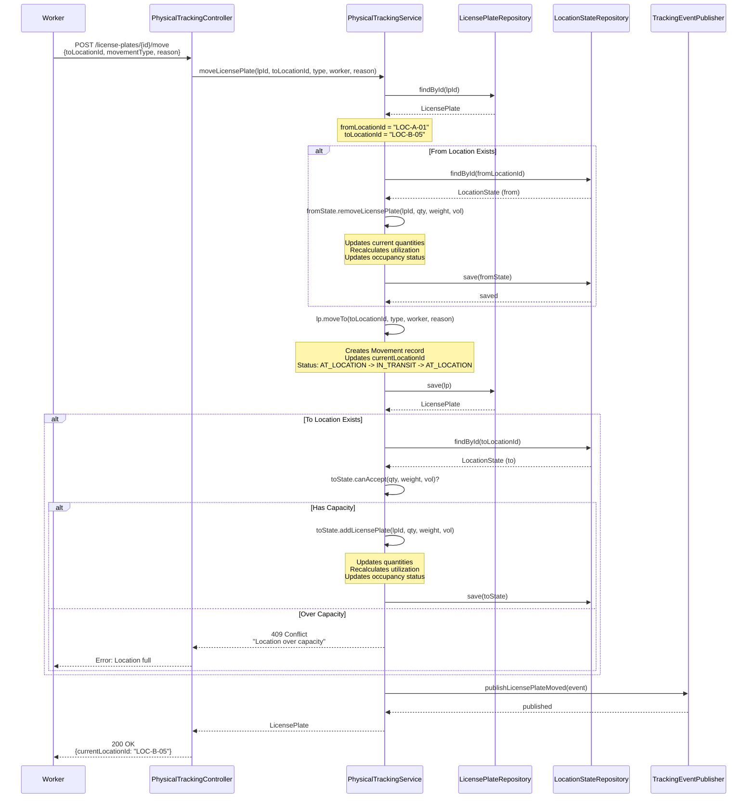

## 3. Pick Items from License Plate

This flow shows picking items from a license plate for order fulfillment.

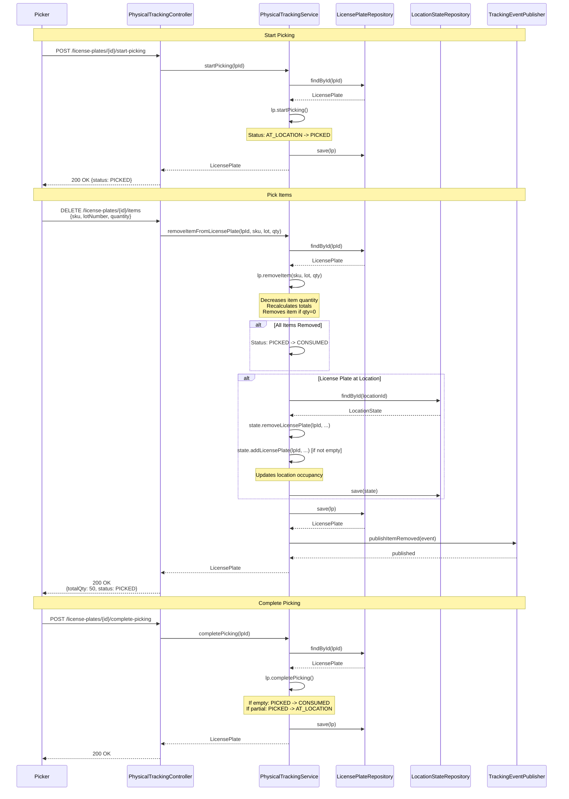

## 4. Location Blocking and Capacity Management

This flow shows how locations are blocked/unblocked and how capacity constraints are enforced.

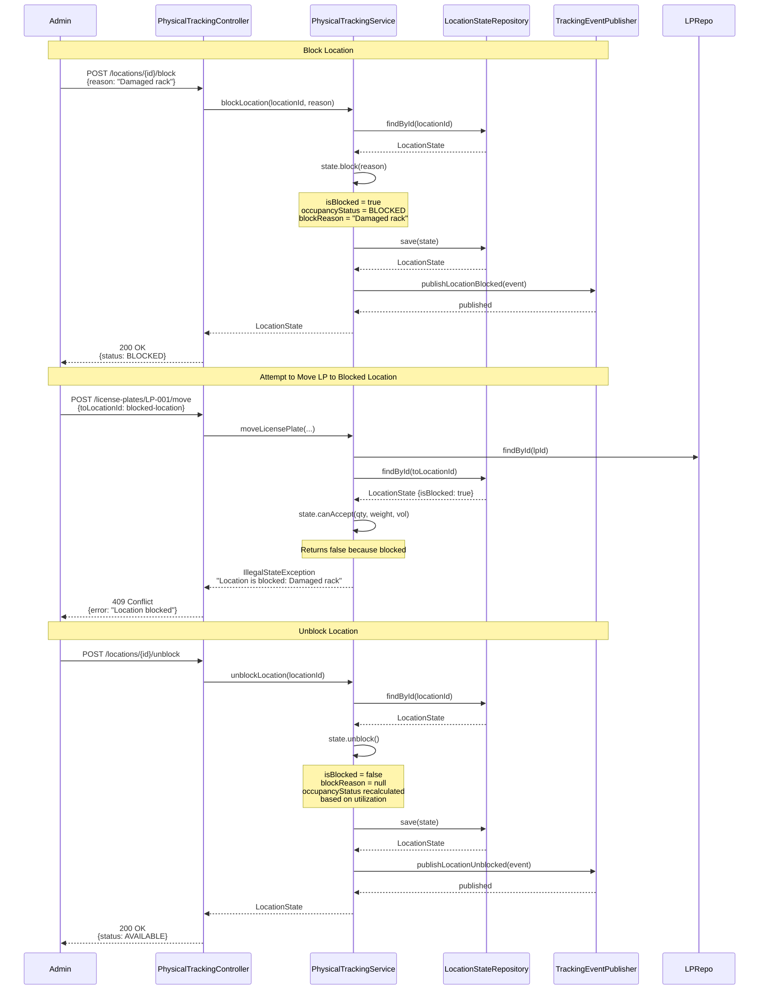

## 5. RTLS Integration and Real-Time Location Updates

This flow shows integration with Real-Time Location Systems for automatic location updates.

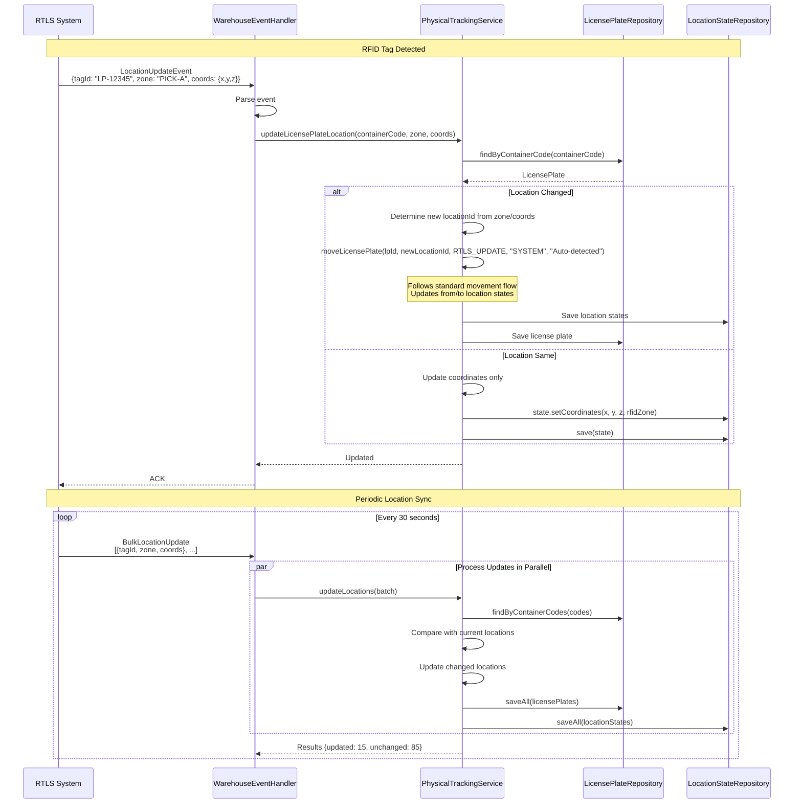

## 6. Query Location State and License Plates

This flow shows how to query location state and retrieve all license plates at a location.

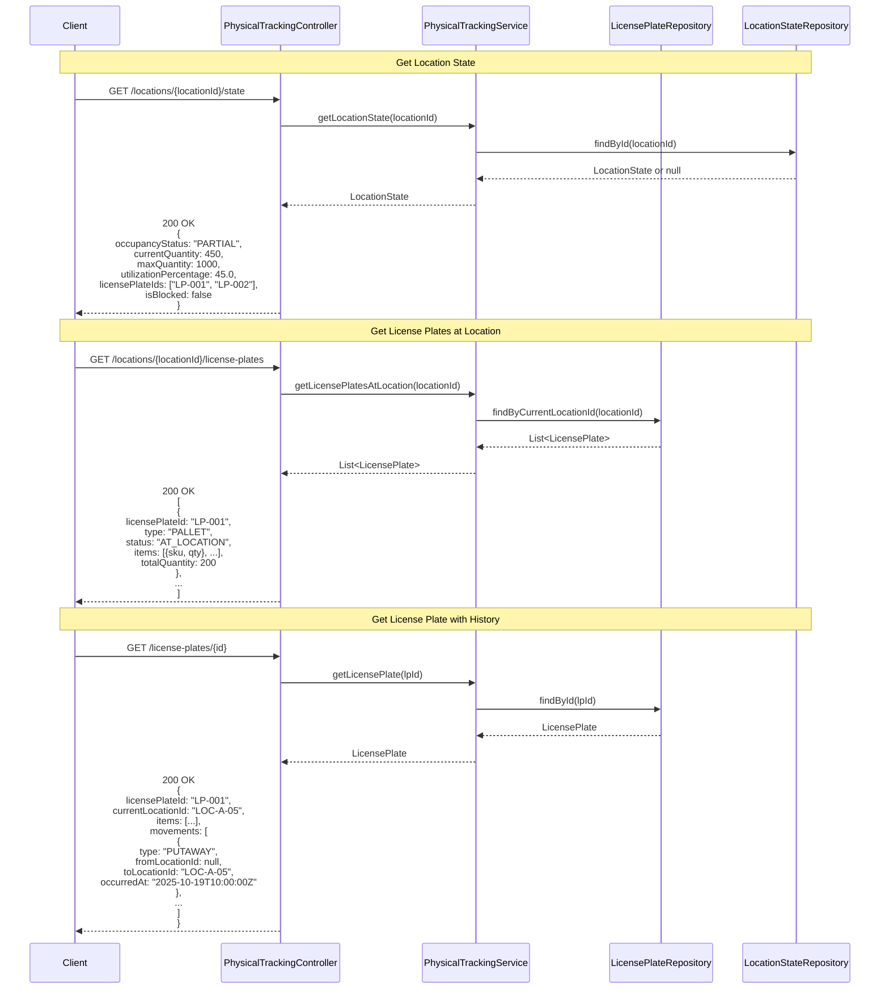

## 7. Capacity Alert and Overflow Handling

This flow demonstrates what happens when a location reaches or exceeds capacity.

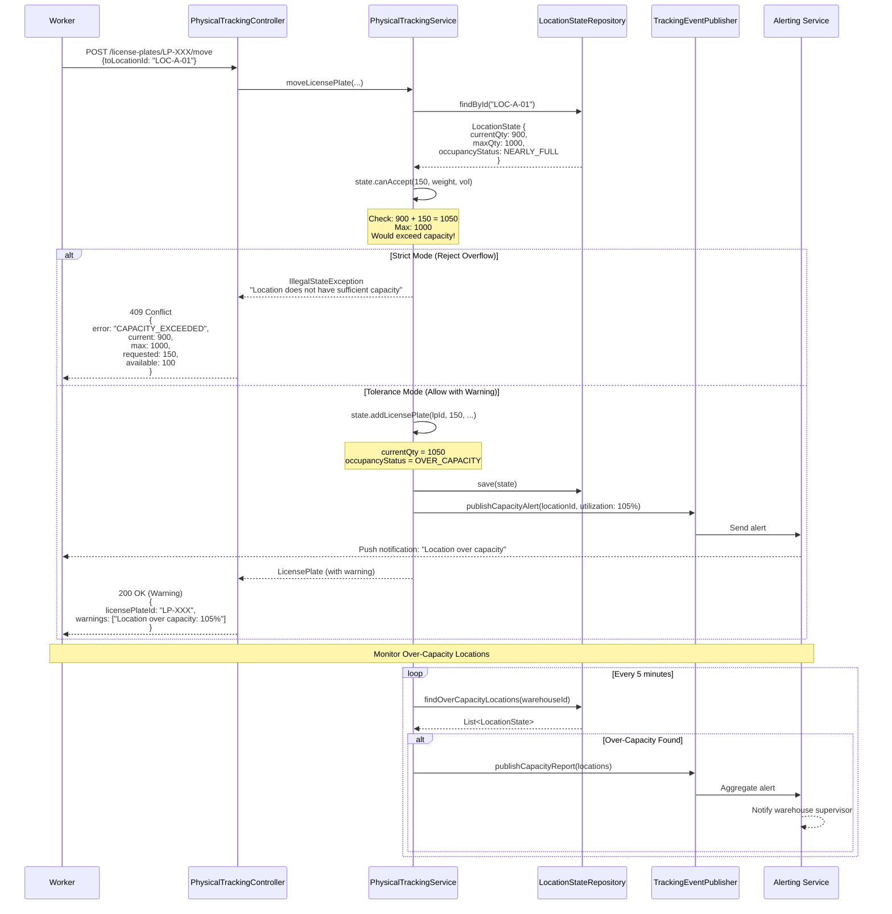

## 8. Complete Lifecycle: Receiving to Shipping

This comprehensive flow shows a license plate's journey from creation through shipping.

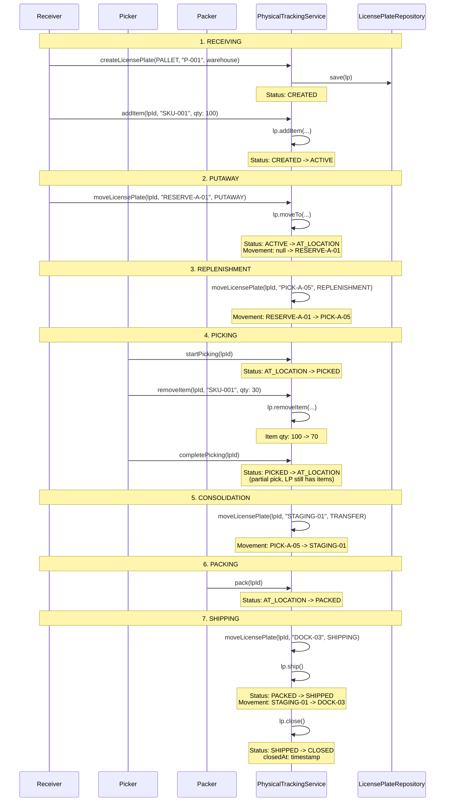

## Error Scenarios

### Scenario 1: Moving Non-Existent License Plate
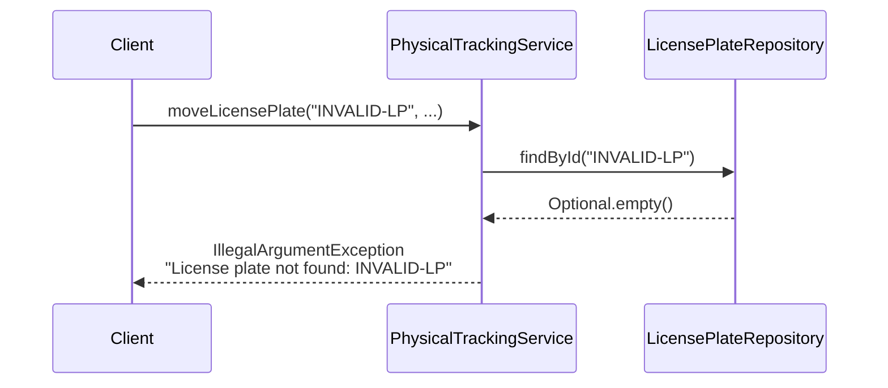

### Scenario 2: Adding Items to Shipped License Plate
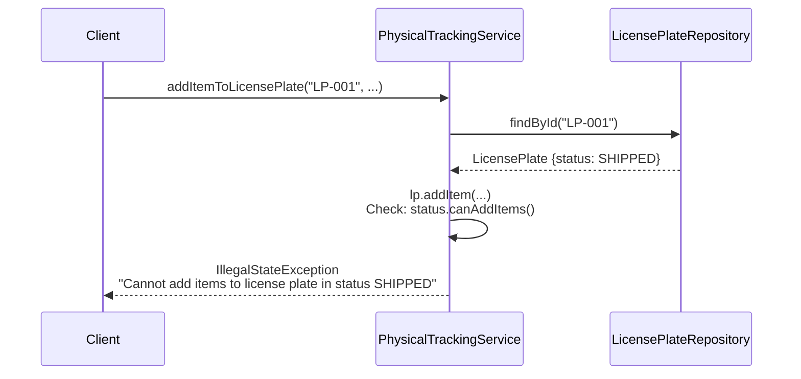

### Scenario 3: Removing More Items Than Available
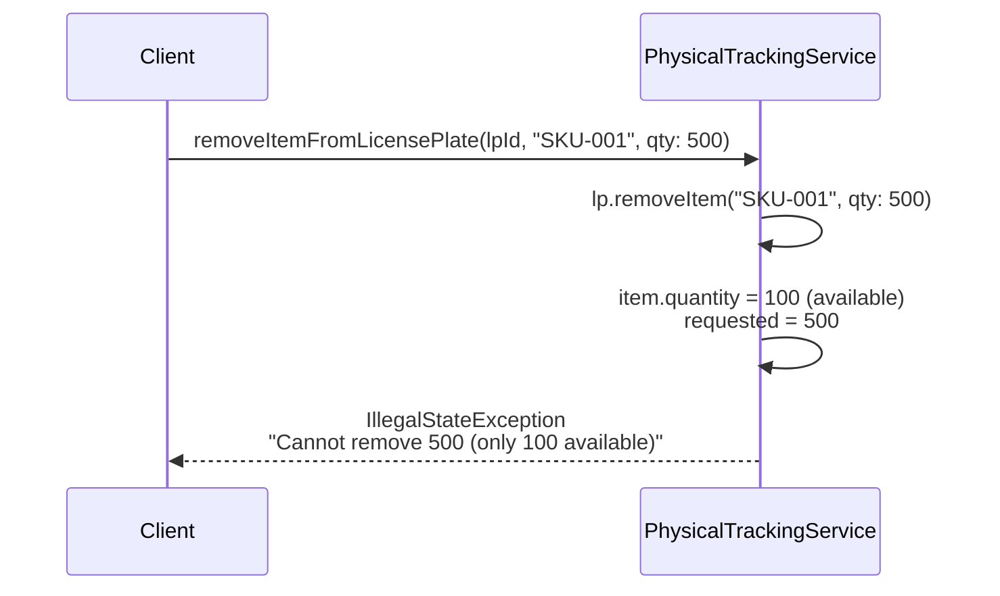

## Performance Considerations

### Batch Movement Processing
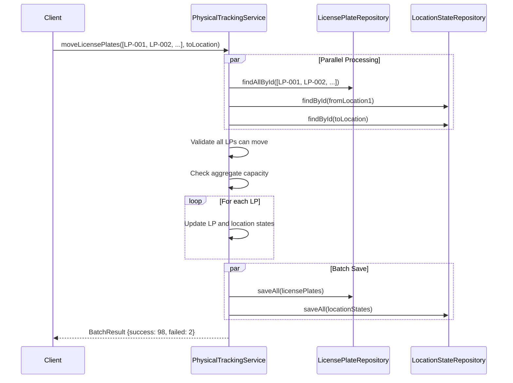

## Event Publishing Patterns

### Async Event Publishing with Retry
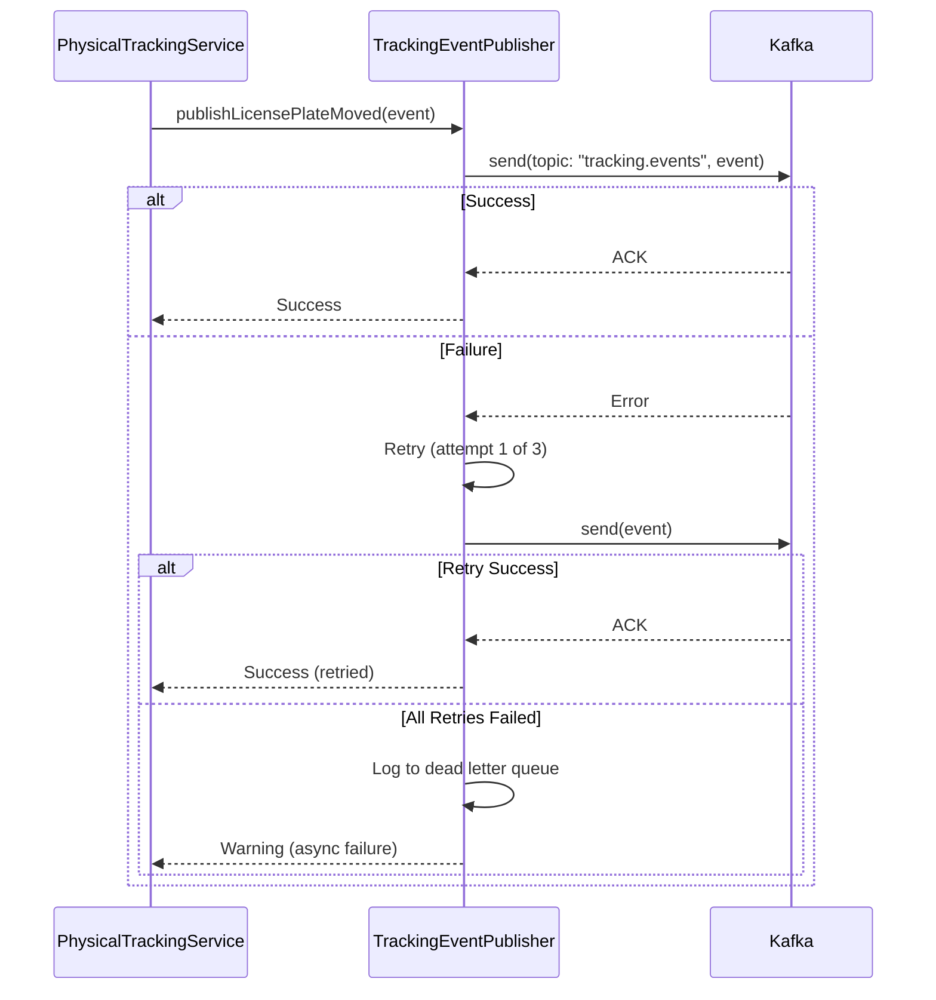
