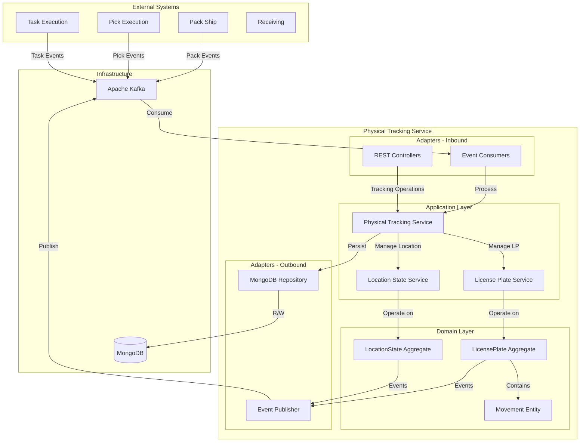

# Physical Tracking Service - Architecture

Real-time inventory location and movement tracking with license plate management and location state monitoring.

## High-Level System Architecture



## Application Services

### Physical Tracking Service
- `createLicensePlate(LPRequest)` - Create license plate
- `moveLicensePlate(String lpId, String toLocation)` - Move LP
- `addItemToLP(String lpId, LPItem item)` - Add item
- `removeItemFromLP(String lpId, String itemId)` - Remove item
- `closeLicensePlate(String lpId)` - Close LP
- `blockLocation(String locationId, String reason)` - Block location
- `unblockLocation(String locationId)` - Unblock location

### License Plate Service
- `createLP(String warehouseId, LicensePlateType type)` - Create new LP
- `updateStatus(String lpId, LicensePlateStatus status)` - Update status
- `addMovement(String lpId, Movement movement)` - Record movement
- `getMovementHistory(String lpId)` - Get full history
- `findLPsAtLocation(String locationId)` - Query by location

### Location State Service
- `updateOccupancy(String locationId)` - Recalculate occupancy
- `checkCapacity(String locationId, LicensePlate lp)` - Validate capacity
- `getUtilization(String locationId)` - Calculate utilization %
- `findOverCapacityLocations(String warehouseId)` - Find violations

## Domain Model

### LicensePlate Aggregate

```java
public class LicensePlate {
    private String licensePlateId;
    private String warehouseId;
    private LicensePlateType type;
    private LicensePlateStatus status;
    private String currentLocationId;
    private String containerCode; // Barcode
    private List<LPItem> items;
    private List<Movement> movements;

    public void moveTo(String toLocationId, String operatorId, String taskId) {
        validateCanMove();

        Movement movement = new Movement(
            MovementType.TRANSFER,
            currentLocationId,
            toLocationId,
            operatorId,
            LocalDateTime.now(),
            taskId
        );

        this.movements.add(movement);
        this.currentLocationId = toLocationId;
        this.updatedAt = LocalDateTime.now();

        // Publish event
        registerEvent(new LicensePlateMoved(this));
    }

    public void addItem(LPItem item) {
        validateCanAddItems();
        validateCapacity(item);

        items.add(item);
        recalculateTotals();
        registerEvent(new ItemAddedToLicensePlate(this, item));
    }
}
```

### LocationState Aggregate

```java
public class LocationState {
    private String locationId;
    private String warehouseId;
    private OccupancyStatus occupancyStatus;
    private List<String> licensePlateIds;
    private Integer currentQuantity;
    private BigDecimal currentWeight;
    private BigDecimal currentVolume;
    private Boolean isBlocked;
    private String blockReason;

    public void addLicensePlate(LicensePlate lp) {
        validateNotBlocked();
        validateCapacity(lp);

        licensePlateIds.add(lp.getLicensePlateId());
        currentQuantity += lp.getTotalQuantity();
        currentWeight = currentWeight.add(lp.getTotalWeight());
        currentVolume = currentVolume.add(lp.getTotalVolume());

        updateOccupancyStatus();
        registerEvent(new LocationStateChanged(this));
    }

    private void updateOccupancyStatus() {
        double utilization = getUtilizationPercentage().doubleValue();

        if (isBlocked) {
            occupancyStatus = OccupancyStatus.BLOCKED;
        } else if (utilization == 0) {
            occupancyStatus = OccupancyStatus.EMPTY;
        } else if (utilization <= 25) {
            occupancyStatus = OccupancyStatus.AVAILABLE;
        } else if (utilization <= 60) {
            occupancyStatus = OccupancyStatus.PARTIAL;
        } else if (utilization <= 90) {
            occupancyStatus = OccupancyStatus.NEARLY_FULL;
        } else if (utilization <= 100) {
            occupancyStatus = OccupancyStatus.FULL;
        } else {
            occupancyStatus = OccupancyStatus.OVER_CAPACITY;
        }
    }
}
```

## Movement Tracking

### Movement Types and Effects

```java
public enum MovementType {
    PUTAWAY(true, false),           // Adds inventory
    PICK(false, true),              // Removes inventory
    REPLENISHMENT(true, false),     // Adds inventory
    TRANSFER(false, false),         // Neutral
    CONSOLIDATION(false, false),    // Neutral
    RELOCATION(false, false),       // Neutral
    CYCLE_COUNT(false, false),      // Verification only
    ADJUSTMENT(true, true),         // Can add or remove
    SHIPPING(false, true),          // Removes inventory
    RECEIVING(true, false);         // Adds inventory

    private final boolean addsInventory;
    private final boolean removesInventory;
}
```

## Database Design

### LicensePlate Collection

```json
{
  "_id": "lp-12345",
  "licensePlateId": "lp-12345",
  "warehouseId": "warehouse-1",
  "type": "PALLET",
  "status": "AT_LOCATION",
  "currentLocationId": "A1-01-02",
  "containerCode": "PL00012345",
  "items": [
    {
      "itemId": "item-1",
      "sku": "SKU-001",
      "lotNumber": "LOT-2025-001",
      "quantity": 100,
      "weight": 50.5,
      "volume": 25.2,
      "uom": "EA",
      "addedAt": "2025-10-19T10:00:00Z"
    }
  ],
  "movements": [
    {
      "movementId": "mov-1",
      "type": "PUTAWAY",
      "fromLocationId": "RECEIVING",
      "toLocationId": "A1-01-02",
      "performedBy": "operator-123",
      "occurredAt": "2025-10-19T10:00:00Z",
      "taskId": "task-456"
    }
  ],
  "totalQuantity": 100,
  "totalWeight": 50.5,
  "totalVolume": 25.2,
  "createdAt": "2025-10-19T09:00:00Z",
  "updatedAt": "2025-10-19T10:00:00Z"
}
```

### LocationState Collection

```json
{
  "_id": "A1-01-02",
  "locationId": "A1-01-02",
  "warehouseId": "warehouse-1",
  "zone": "A1",
  "occupancyStatus": "PARTIAL",
  "licensePlateIds": ["lp-12345", "lp-67890"],
  "maxQuantity": 500,
  "currentQuantity": 250,
  "maxWeight": 2000.0,
  "currentWeight": 1200.5,
  "maxVolume": 100.0,
  "currentVolume": 60.3,
  "isBlocked": false,
  "xCoordinate": 10.5,
  "yCoordinate": 20.3,
  "zCoordinate": 1.2,
  "lastUpdated": "2025-10-19T10:00:00Z",
  "lastMovementAt": "2025-10-19T10:00:00Z"
}
```

### MongoDB Indexes

```javascript
// LicensePlate indexes
db.licensePlates.createIndex({ "licensePlateId": 1 }, { unique: true })
db.licensePlates.createIndex({ "containerCode": 1 }, { unique: true, sparse: true })
db.licensePlates.createIndex({ "currentLocationId": 1, "status": 1 })
db.licensePlates.createIndex({ "warehouseId": 1, "status": 1 })
db.licensePlates.createIndex({ "items.sku": 1 })

// LocationState indexes
db.locationStates.createIndex({ "locationId": 1 }, { unique: true })
db.locationStates.createIndex({ "warehouseId": 1, "zone": 1 })
db.locationStates.createIndex({ "warehouseId": 1, "occupancyStatus": 1 })
db.locationStates.createIndex({ "isBlocked": 1, "warehouseId": 1 })

// Geospatial index for 3D coordinates
db.locationStates.createIndex({
  "xCoordinate": 1,
  "yCoordinate": 1,
  "zCoordinate": 1
})
```

## Event Processing

### Event Handlers

```java
@KafkaListener(topics = "pick.confirmed")
public void handlePickConfirmed(CloudEvent event) {
    PickConfirmedEvent data = extractEventData(event);

    // Update license plate status
    LicensePlate lp = licensePlateRepository.findById(data.getLicensePlateId());
    lp.removeItem(data.getItemId(), data.getPickedQuantity());
    lp.updateStatus(LicensePlateStatus.PICKED);

    // Record movement
    Movement movement = new Movement(
        MovementType.PICK,
        data.getLocationId(),
        "STAGING",
        data.getOperatorId(),
        data.getPickTime(),
        data.getTaskId()
    );
    lp.addMovement(movement);

    licensePlateRepository.save(lp);

    // Update location state
    locationStateService.removeLicensePlate(data.getLocationId(), lp.getLicensePlateId());

    // Publish event
    eventPublisher.publish(new LicensePlatePicked(lp));
}
```

## Configuration

```yaml
# Tracking Configuration
tracking:
  archive:
    closed-lp-days: 90  # Archive closed LPs after 90 days
  cache:
    location-state-ttl: 5m
    lp-status-ttl: 1m
  movement:
    batch-size: 100
  capacity:
    alert-threshold: 90  # Alert at 90% capacity
  rfid:
    enabled: false

# MongoDB Configuration
spring:
  data:
    mongodb:
      uri: mongodb://localhost:27017/physical-tracking
      auto-index-creation: true

# MongoDB TTL Index for archiving
# db.licensePlates.createIndex(
#   { "closedAt": 1 },
#   { expireAfterSeconds: 7776000 }  // 90 days
# )
```

## Performance Optimizations

### Caching Strategy
- Location state cached for 5 minutes
- License plate status cached for 1 minute
- Movement history not cached (audit trail)
- Geospatial queries cached for 15 minutes

### Batch Processing
- Bulk movement recording
- Batch location state updates
- Aggregate capacity calculations

### Database Optimization
- Compound indexes for frequent queries
- Geospatial index for 3D queries
- TTL index for automatic archiving
- Connection pooling

## Monitoring Metrics

- License plates by status
- Location utilization %
- Movements per hour
- Over-capacity location count
- Blocked location count
- Event processing lag
- Average movement time
- Location state sync accuracy
